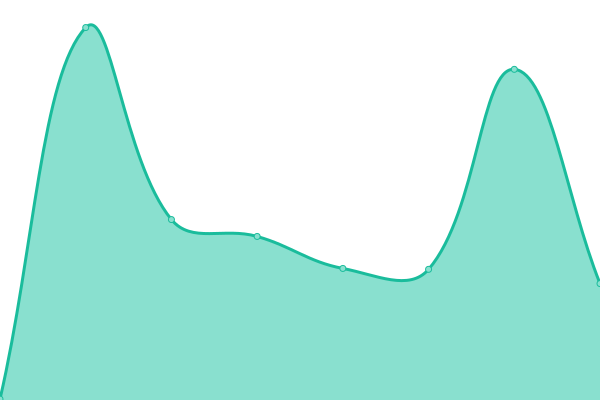
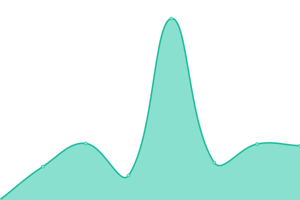
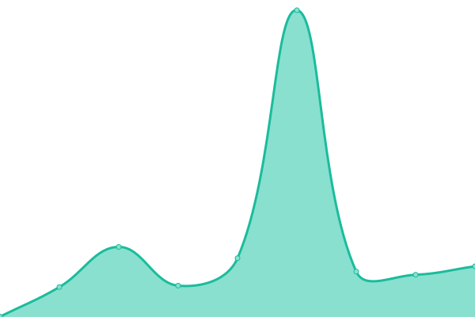

# [📈 Live Status](https://status.esaudrivera.com): <!--live status--> **🟩 All systems operational**

This repository contains the open-source uptime monitor and status page for [Esaud Rivera Lagos](https://status.esaudrivera.com), powered by [Upptime](https://github.com/upptime/upptime).

With [Upptime](https://upptime.js.org), you can get your own unlimited and free uptime monitor and status page, powered entirely by a GitHub repository. We use [Issues](https://github.com/Esaud17/Upptime/issues) as incident reports, [Actions](https://github.com/Esaud17/Upptime/actions) as uptime monitors, and [Pages](https://status.esaudrivera.com) for the status page.

<!--start: status pages-->
<!-- This summary is generated by Upptime (https://github.com/upptime/upptime) -->
<!-- Do not edit this manually, your changes will be overwritten -->
<!-- prettier-ignore -->
| URL | Status | History | Response Time | Uptime |
| --- | ------ | ------- | ------------- | ------ |
|  [Delivery Appio](https://delivery.appio.com.mx/) | 🟩 Up | [delivery-appio.yml](https://github.com/appio-smart-kitchen/upptime/commits/HEAD/history/delivery-appio.yml) | 

 385ms
     
 | 

<a href="https://appio-smart-kitchen.github.io/upptime/history/delivery-appio">100.00%</a>
    

|  [Growth Appio](https://growth.appio.com.mx/) | 🟩 Up | [growth-appio.yml](https://github.com/appio-smart-kitchen/upptime/commits/HEAD/history/growth-appio.yml) | 

 417ms
     
 | 

<a href="https://appio-smart-kitchen.github.io/upptime/history/growth-appio">100.00%</a>
    

|  [Gaming Appio](https://gaming.appio.com.mx/) | 🟩 Up | [gaming-appio.yml](https://github.com/appio-smart-kitchen/upptime/commits/HEAD/history/gaming-appio.yml) | 

 272ms
     
 | 

<a href="https://appio-smart-kitchen.github.io/upptime/history/gaming-appio">100.00%</a>
    

|  [Registro Appio](https://registro.appio.com.mx) | 🟩 Up | [registro-appio.yml](https://github.com/appio-smart-kitchen/upptime/commits/HEAD/history/registro-appio.yml) | 

 772ms
     
 | 

<a href="https://appio-smart-kitchen.github.io/upptime/history/registro-appio">100.00%</a>
    

|  [Panel Appio](https://panel.appio.com.mx) | 🟩 Up | [panel-appio.yml](https://github.com/appio-smart-kitchen/upptime/commits/HEAD/history/panel-appio.yml) | 

 167ms
     
 | 

<a href="https://appio-smart-kitchen.github.io/upptime/history/panel-appio">100.00%</a>
    

|  [Delivery Api](https://deliveryapi.appio.com.mx/) | 🟩 Up | [delivery-api.yml](https://github.com/appio-smart-kitchen/upptime/commits/HEAD/history/delivery-api.yml) | 

 154ms
     
 | 

<a href="https://appio-smart-kitchen.github.io/upptime/history/delivery-api">100.00%</a>
    

|  [Payment Api](https://paymentapi.appio.com.mx/api) | 🟩 Up | [payment-api.yml](https://github.com/appio-smart-kitchen/upptime/commits/HEAD/history/payment-api.yml) | 

 145ms
     
 | 

<a href="https://appio-smart-kitchen.github.io/upptime/history/payment-api">100.00%</a>
    

|  [Appio Api](https://api.appio.com.mx/api/v2/upptime/validate) | 🟩 Up | [appio-api.yml](https://github.com/appio-smart-kitchen/upptime/commits/HEAD/history/appio-api.yml) | 

 2505ms
     
 | 

<a href="https://appio-smart-kitchen.github.io/upptime/history/appio-api">100.00%</a>
    

|  [Staging Panel Apio](https://stagingpanel.appio.com.mx) | 🟩 Up | [staging-panel-apio.yml](https://github.com/appio-smart-kitchen/upptime/commits/HEAD/history/staging-panel-apio.yml) | 

 130ms
     
 | 

<a href="https://appio-smart-kitchen.github.io/upptime/history/staging-panel-apio">100.00%</a>
    

|  [Staging Appio Api](https://stagingapi.appio.com.mx/api/v2/upptime/validate) | 🟩 Up | [staging-appio-api.yml](https://github.com/appio-smart-kitchen/upptime/commits/HEAD/history/staging-appio-api.yml) | 

 134ms
     
 | 

<a href="https://appio-smart-kitchen.github.io/upptime/history/staging-appio-api">100.00%</a>
    

<!--end: status pages-->

[**Visit our status website →**](https://status.esaudrivera.com)

## 📄 License

- Powered by: [Upptime](https://github.com/upptime/upptime)
- Code: [MIT](./LICENSE) © [Esaud Rivera Lagos](https://status.esaudrivera.com)
- Data in the `./history` directory: [Open Database License](https://opendatacommons.org/licenses/odbl/1-0/)
